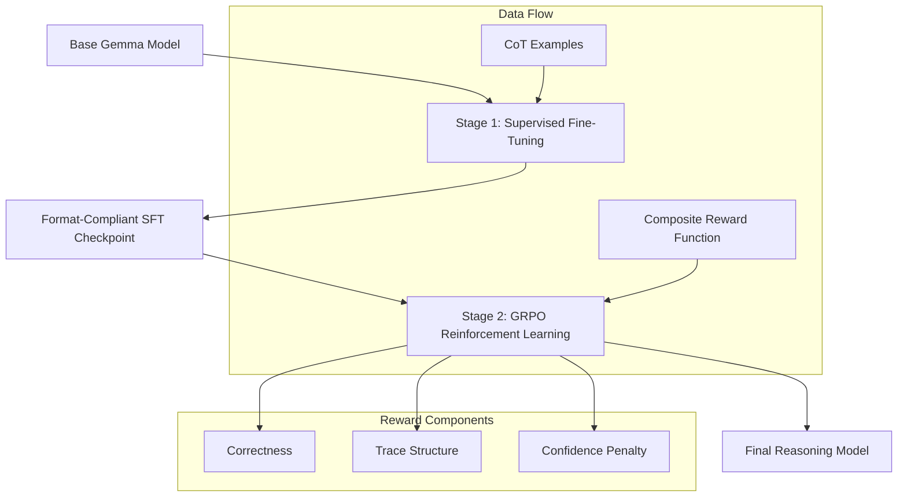

# Teaching Gemma to Show Its Work: Reasoning Traces with Tunix

[](https://www.python.org/)
[](https://github.com/google/jax)
[](https://github.com/google/flax)
[](https://ai.google.dev/gemma)
[](https://www.kaggle.com/)

This project implements a two-stage post-training pipeline to teach Gemma3-1B how to produce structured reasoning traces. By leveraging the Tunix library on Kaggle TPUs, we transition models from direct answering to a chain-of-thought format.


## Results

### Learning Curves

The training demonstrates stable GRPO optimization with curriculum learning and reward weight annealing:


- **Loss**: Decreases monotonically from 0.40 to 0.03
- **Reward**: Increases with curriculum phase transitions  
- **Trace Score**: Improves with difficulty-aware scoring
- **Weight Annealing**: Visible transition from trace-focus to correctness-focus

### Before vs After

| Example | Before (Base) | After (GRPO) | Improvement |
|---------|---------------|--------------|-------------|
| Janet's apples | 0.090 | 0.916 | +0.826 |
| Binary search | 0.090 | 0.896 | +0.806 |
| Workers problem | 0.090 | 0.892 | +0.802 |

## Training Architecture

The pipeline follows a progressive refinement strategy, moving from supervised imitation to on-policy reinforcement learning.



## Objective

The primary goal is to enforce a strict output schema that separates reasoning from the final answer.

```xml
<reasoning>
Step 1: Identify the problem components.
Step 2: Apply the relevant formula or logic.
Step 3: Calculate the result.
Therefore, the answer is derived.
</reasoning>
<answer>
The final concise result is placed here.
</answer>
```

## Key Innovations

1. **Curriculum Learning**: Training progresses through difficulty phases (easy → medium → hard)
2. **Difficulty-Aware Trace Scoring**: Harder phases require more reasoning steps
3. **Reward Weight Annealing**: `w_trace: 0.45→0.25`, `w_correct: 0.40→0.60`
4. **Calibrated Confidence**: Penalizes overconfident wrong answers
5. **Verbosity Penalty**: Prevents rambling by limiting reasoning length

## Quick Start

### Environment Setup

```bash
pip install git+https://github.com/google/tunix.git
pip install jax jaxlib flax optax transformers datasets
```

### Running the Notebook

1. Open `notebooks/tunix-gemma-reasoning-submission.ipynb` on Kaggle
2. Enable TPU v5e-8 accelerator
3. Attach model: `google/gemma-3/transformers/gemma-3-1b-it`
4. Run all cells (~70 seconds for demo, ~9 hours for full training)

## Reward Mechanism

The GRPO phase utilizes a multi-objective reward function with annealing:

| Component | Weight | Description |
| :--- | :--- | :--- |
| Correctness | 40%→60% | Verifies the final answer (annealed) |
| Trace Structure | 45%→25% | Evaluates logical flow (annealed) |
| Confidence | 15% | Calibrates model confidence |
| Verbosity | -5% | Penalizes excessive length |

## Ablation Study

| Config | Good+Reasoning | Correct NoTrace | Wrong+Trace |
|--------|----------------|-----------------|-------------|
| Correctness Only | 1.000 | 1.000 | 0.000 |
| + Trace Structure | 0.892 | 0.775 | 0.150 |
| + Confidence | 0.842 | 0.737 | 0.211 |
| Annealed (early) | 0.890 | 0.680 | 0.250 |

## Training Regimes

| Regime | Time | Purpose |
|--------|------|---------|
| Demo (this notebook) | ~70 seconds | Validate GRPO mechanics |
| Full training | ~7-9 hours | Production-grade results |

## Scientific Foundations

This implementation draws from several foundational papers:

* **DeepSeek-R1**: On the scaling of reasoning capabilities via RL
* **RLVR**: Reinforcement Learning from Verifiable Rewards
* **Rubrics-as-Rewards**: Providing structured feedback for open-ended traces

## Resources

- **Kaggle Notebook**: [tunix-gemma-reasoning-submission](https://www.kaggle.com/code/ashutosh0x/tunix-gemma-reasoning-submission)
- **Tunix Library**: [github.com/google/tunix](https://github.com/google/tunix)
- **Writeup**: [submissions/kaggle_writeup.md](submissions/kaggle_writeup.md)

## Demo Video

[](https://youtu.be/-acXXMqog34)

## License

This project is released under the Apache 2.0 License.

