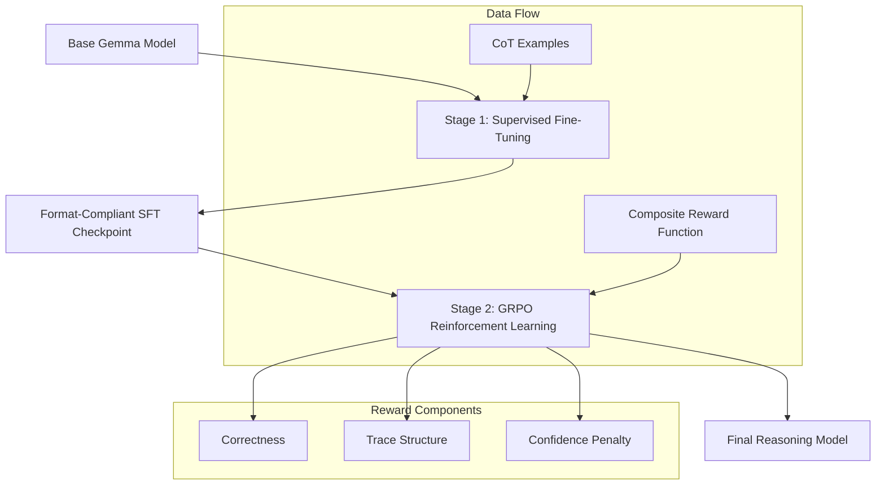

# Teaching Gemma to Show Its Work: Reasoning Traces with Tunix

[](https://www.python.org/)
[](https://github.com/google/jax)
[](https://github.com/google/flax)
[](https://ai.google.dev/gemma)
[](https://www.kaggle.com/)

This project implements a two-stage post-training pipeline to teach Gemma3-1B and Gemma2-2B how to produce structured reasoning traces. By leveraging the Tunix library on Kaggle TPUs, we transition models from direct answering to a chain-of-thought format.

## Training Architecture

The pipeline follows a progressive refinement strategy, moving from supervised imitation to on-policy reinforcement learning.



## Objective

The primary goal is to enforce a strict output schema that separates reasoning from the final answer.

```xml
<reasoning>
The model demonstrates its step-by-step thinking process here.
</reasoning>
<answer>
The final concise result is placed here.
</answer>
```

## Quick Start Technical Guide

### Environment Setup

Install the required JAX-based stack and the Tunix library.

```bash
pip install git+https://github.com/google/tunix.git
pip install jax jaxlib flax optax transformers datasets
```

### Data Preparation

Format your raw datasets into the required reasoning-answer structure.

```python
from src.data_utils import load_gsm8k, prepare_training_data

examples = load_gsm8k("data/raw/gsm8k.jsonl")
prepare_training_data(examples, "data/prepared/train.jsonl")
```

### Training Execution

Refer to the high-performance notebooks for the complete execution flow.

1.  **Supervised Fine-Tuning**: Initialize format compliance in `notebooks/02_sft_training.ipynb`.
2.  **GRPO Optimization**: Enhance reasoning quality in `notebooks/03_rl_grpo_training.ipynb`.

## Reward Mechanism

The Group Relative Policy Optimization (GRPO) phase utilizes a multi-objective reward function to refine model outputs.

| Component | Weight | Description |
| :--- | :--- | :--- |
| Correctness | 0.60 | Verifies the final answer against reference values. |
| Trace Structure | 0.25 | Evaluates logical flow and use of transition markers. |
| Confidence | 0.15 | Calibrates model confidence to penalize halluncinated certainty. |

## Kaggle TPU Execution Schedule

The training is designed to stay within the 9-hour TPU session limit on Kaggle.

| Timeline | Phase | Activity |
| :--- | :--- | :--- |
| 00:00 - 00:30 | Initialization | Library installation and shard loading. |
| 00:30 - 03:00 | SFT Phase | High-learning-rate supervised fine-tuning. |
| 03:00 - 07:30 | GRPO Phase | On-policy RL with sample generation and updates. |
| 07:30 - 09:00 | Validation | Final evaluation and Kaggle-compatible export. |

## Scientific Foundations

This implementation draws from several foundational papers in the field of Large Language Model reasoning:

*   **DeepSeek-R1**: On the scaling of reasoning capabilities via RL.
*   **RLVR**: Reinforcement Learning from Verifiable Rewards.
*   **Rubrics-as-Rewards**: Providing structured feedback for open-ended traces.

## License

This project is released under the Apache 2.0 License.